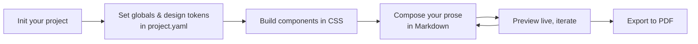
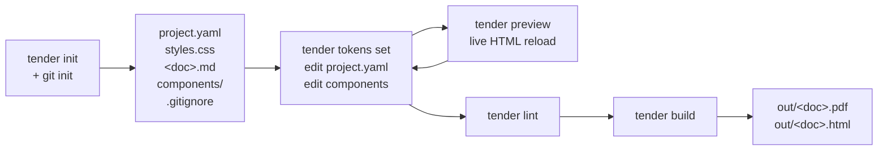
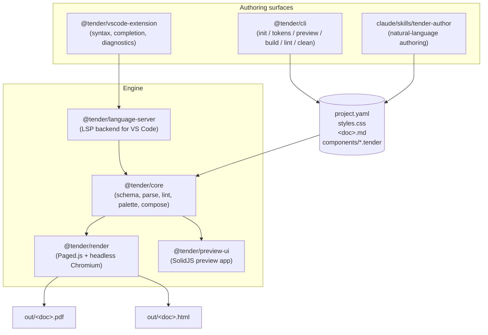

```
████████ ███████ ███    ██ ██████  ███████ ██████
   ██    ██      ████   ██ ██   ██ ██      ██   ██
   ██    █████   ██ ██  ██ ██   ██ █████   ██████
   ██    ██      ██  ██ ██ ██   ██ ██      ██   ██
   ██    ███████ ██   ████ ██████  ███████ ██   ██
```

# Layout-as-code for print.

Scaffold in YAML, build components in CSS, compose in Markdown, export to PDF.

*Built by [possibleworlds.space](https://possibleworlds.space).*

---

## What is Tender?

Tender is a print-layout tool for people who'd rather express a document as code than wrestle a WYSIWYG editor. You declare your design vocabulary (page templates, design tokens, fonts) in `project.yaml`, write reusable components as single `.tender` files (frontmatter + Handlebars + scoped CSS), and compose your prose in Markdown. A small CLI watches your sources, runs them through CSS Paged Media in headless Chromium, and produces a print-ready PDF — typeset to the standard you'd expect from InDesign, in a workflow that diffs cleanly in git.

The opinions are deliberately narrow: a fixed cascade order, a `.page` wrapper around every page, project-local asset paths, no post-render JS. Beyond that, anything Chromium renders works — full Grid, Flexbox, modern selectors, container queries, custom properties, the lot — plus everything Paged.js polyfills of the print spec. The point isn't to invent a new layout engine; it's to make the existing one ergonomic for documents that need to ship as PDFs.

## What you do



Most of the day is in that *compose ↔ preview* loop. Set things up once at the start; export when you're happy.

## How it flows



The loop in the middle (edit → preview) is the day-to-day; `init` happens once, `build` happens when you ship.

## Architecture



The CLI and the Claude skill are peer **control surfaces** — both speak directly to your source files and run the same engine underneath. The VS Code extension is an editing surface; it talks to the language server, not the build pipeline.

## Install

Requires Node 20+ and pnpm.

```
git clone https://github.com/joshajh/tender.git
cd tender
pnpm install
pnpm -r build
```

For a global `tender` command:

```
pnpm --filter @tender/cli link --global
```

## Quick start

```
tender init my-doc
tender build my-doc
open my-doc/out/content.pdf
```

`tender preview my-doc` runs a live-reloading HTML preview at http://127.0.0.1:3993.

## Onboarding from existing prose

Pasting from Google Docs, Word, Pages, or another tool? After `tender init`, paste your prose into `content.md`, then sanitise:

```
tender clean my-doc/content.md          # strips BOMs, NBSPs, soft hyphens, mixed line endings, trailing whitespace
tender clean --typography my-doc/content.md   # also: curly quotes, em-dashes, ellipses
```

(In a multi-document project, `tender clean` requires an explicit path — the markdown file you want sanitised.)

Then start authoring components in the live preview.

## Project structure

```
my-doc/
  project.yaml      # page templates, typography, fonts, inline shortcuts, design tokens, clean, render
  styles.css        # presentation
  *.md              # one or more documents at the project root (e.g. content.md, resume.md)
  components/
    row.tender      # one .tender file per component
    callout.tender
  assets/
    images/
    fonts/
  .gitignore        # written by `tender init`; ignores out/, node_modules/, dist/
```

Documents are CommonMark plus the GitHub-flavoured extensions: pipe tables, `~~strikethrough~~`, task lists, autolinks, and `[^footnote]` references — see the [user guide](docs/user-guide.md#headings-lists-paragraphs-emphasis).

## Design tokens

Define your project's design vocabulary in `project.yaml` under `design-tokens:`:

```yaml
design-tokens:
  color:
    ink: '#1a1a1a'
    accent: '#FFE600'
  size:
    body: 12pt
```

These compile to CSS custom properties (`--color-ink`, `--size-body`, …) your components consume via `var()`. See the [design tokens guide](docs/user-guide.md#design-tokens) for the full schema and the `tender tokens` CLI.

## Preview UI

`tender preview` opens a tabbed UI:

- **Preview** — the live-reloading rendered output.
- **Palette** — gallery of components and typography in this project, each rendered with project styles.
- **Help** — the user guide, with a "Load example" panel for installing a worked-example project (today: `open-circle`) into the current directory.
- **Export** — build PDFs into the project's `out/` directory: one button per document, plus "Build all PDFs"; each result links to a download. Same output as `tender build` (PDF only — no HTML mirror).

Preview, Palette, and Help update automatically when you edit project files.

## Control surfaces

Tender has two equal control surfaces — the CLI and the Claude skill. Both operate directly on your project files and run the same engine. Use whichever fits the task.

### `tender` — the CLI

Six commands, all run from inside (or pointed at) a project directory.

- **`tender init [dir]`** — scaffold a new project from the default starter (idempotent; preserves existing files), write a `.gitignore`, and `git init` unless the directory is already a repo. On a terminal it offers to make an initial commit; `--no-commit` skips that. Pass `--example` (or `--example=open-circle`) to scaffold the worked-example project instead — refuses on conflict, override with `--force`.
- **`tender build [dir]`** — render every document at the project root to `out/<basename>.pdf` and `out/<basename>.html`. Flags: `--doc <name>` to build a single document, `--out <path>` to redirect the output directory, `--pdf-only` / `--html-only` to skip the other, `--timeout <ms>` to raise the Paged.js pagination cap (default 60000).
- **`tender preview [dir]`** — live-reloading HTML preview server (`--port`, `--host`). In a multi-document project the preview UI shows a dropdown to switch between documents; `--doc <name>` preselects one.
- **`tender lint [dir]`** — validate the project; surface unused/unknown components, missing assets, deprecated syntax, design-token issues (`--strict`, `--json`).
- **`tender clean [path]`** — sanitise a document: strip paste artifacts; optionally apply smart typography (`--check`, `--yes`, `--typography`). In a multi-document project the path is required.
- **`tender tokens list|set|edit`** — inspect and edit design tokens (`--json` on `list`, AST round-trip on `set` so comments survive, raw-mode TUI on `edit`).

Run `tender --help` (or `tender <command> --help`) for examples on every command.

### `tender-author` — the Claude skill

A Claude Code skill at [`claude/skills/tender-author/`](claude/skills/tender-author/) lets you describe components, style tweaks, content structure, design-token edits, and lint diagnoses in natural language. Claude reads your project, makes the file edits, runs `tender lint`, and reports what landed.

Install via symlink (so `git pull` keeps it fresh):

```bash
ln -s "$(pwd)/claude/skills/tender-author" ~/.claude/skills/tender-author
```

Then, in Claude Code with a Tender project open:

```
> Make a callout component for warnings with a red left border.
> Wrap these dialogue paragraphs as <row> blocks with speaker attributes.
> Change the accent colour to a softer yellow.
> Why is this lint warning firing?
```

The skill is scoped to five authoring concerns: components, styling tweaks, content structuring, design-token edits, and lint/build diagnosis. It doesn't run preview/build, choose fonts, or draft prose — those stay with you.

## Editor support

A VS Code extension lives in [`packages/vscode-extension/`](packages/vscode-extension/). It spawns the language server, registers `.tender` as a custom language with TextMate grammars and snippets, and provides completion, hover, diagnostics, and definition jumps for both `.tender` files and tag-syntax in markdown documents.

The extension isn't on the marketplace yet ([#2](https://github.com/joshajh/tender/issues/2)). The supported install path is to run it from a clone of the repo:

```bash
git clone https://github.com/joshajh/tender.git
cd tender
pnpm install
pnpm -r build
code --extensionDevelopmentPath="$(pwd)/packages/vscode-extension"
```

VS Code opens with the extension live; the language server spawns from the workspace's `node_modules` automatically. The extension stays in sync with the codebase as you `git pull` and rebuild — no reinstall step.

## Reference

- **User guide:** [`docs/user-guide.md`](docs/user-guide.md) — authoring conventions, `project.yaml` reference, `styles.css` patterns, CLI commands, security model.
- **Design plans:** [`docs/plans/`](docs/plans/) — dated design and implementation docs for each feature.
- **Worked example:** [`packages/core/test/fixtures/open-circle-tags/`](packages/core/test/fixtures/open-circle-tags/) — *Open Circle*, a facilitator's playbook for community story workshops. Shows the full authoring stack: `=== page` markers, tag-syntax components, `@@` slots, multi-component layout, and a real `design-tokens:` block.

## Built by Possible Worlds

Tender is built by [Possible Worlds](https://possibleworlds.space) — a small studio working on tools and texts for thinking about better futures. We use Tender ourselves to ship workshop playbooks, research reports, and other documents that live more comfortably as PDFs than as web pages.

If Tender is useful to you, we'd love to hear what you're using it for. File an issue, open a discussion, or get in touch via the website.
